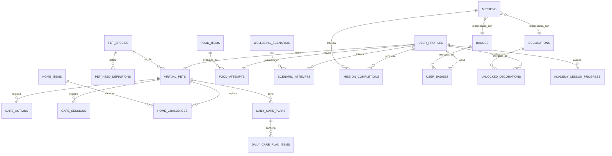

# Base de Datos — HuellitasEnCasa

Motor: **SQLite** vía **Room 2.6.1**. Base de datos única: `huellitas_en_casa.db`. Versión de
esquema: `1`. 21 tablas (las 20 del listado BASE de la especificación + 1 tabla adicional
documentada para el progreso de la Academia).

## 1. Tablas de referencia (contenido semilla, insertadas una vez por `SeedProvider`)

### `pet_species`
| Campo | Tipo | Notas |
|---|---|---|
| id | INTEGER PK autoincrement | |
| code | TEXT | `PERRO`\|`GATO`\|`CONEJO`\|`HAMSTER`\|`AVE` |
| display_name | TEXT | |
| description | TEXT | |
| icon_res | TEXT | nombre de drawable |

### `pet_need_definitions`
| Campo | Tipo | Notas |
|---|---|---|
| id | INTEGER PK | |
| species_id | INTEGER FK → pet_species.id (CASCADE) | |
| need_type | TEXT | uno de los 6 `NeedType` |
| session_decay | INTEGER | descenso máx. por sesión nueva |
| care_tip | TEXT | consejo educativo |

Índice único: `(species_id, need_type)`.

### `food_items` (50 filas semilla)
id · species_id (FK nullable, NULL = aplica a cualquier especie) · name · category
(`ALIMENTO_BUENO`\|`ALIMENTO_MALO`\|`SITUACION`) · icon_res · is_appropriate (BOOLEAN) ·
explanation.

### `home_items` (8 filas semilla)
id · category (`CUENCO_COMIDA`\|`CUENCO_AGUA`\|`CAMA`\|`JUGUETE`\|`HIGIENE`\|`ENTORNO`) · name ·
icon_res · description · compatible_species_csv.

### `wellbeing_scenarios` (30 filas semilla, 6 por especie)
id · species_id (FK nullable) · situation_text · icon_res · options_csv (2-4 opciones
separadas por `|`) · correct_option_index · explanation · recommend_ask_adult (BOOLEAN).

### `badges` (10 filas semilla) / `decorations` (8 filas semilla)
id · code (único) · name · description (solo badges) · icon_res · tier (solo badges) /
category (solo decorations).

### `missions` (30 filas semilla)
id · code · title · description · type (una de 8 `MissionType`) · target_count ·
reward_badge_id (FK → badges.id, `SET_NULL`) · reward_decoration_id (FK → decorations.id,
`SET_NULL`) · order_index · icon_res.

## 2. Tablas de estado del usuario

### `user_profiles`
id · alias · avatar_id · created_at · sound_enabled · haptic_enabled. **Sin datos personales
reales.**

### `virtual_pets`
id · user_profile_id (FK CASCADE) · species_id (FK CASCADE) · name · avatar_variant ·
adopted_at · feeding/hydration/hygiene/activity_level/rest/affection (INTEGER, default 80,
siempre acotados a `[0,100]` por `CareEngine`) · last_session_epoch_day · is_active.

### `care_actions` (historial)
id · virtual_pet_id (FK CASCADE) · action_type · need_type · delta · timestamp. Índices en
`virtual_pet_id` y `timestamp`.

### `care_sessions`
id · virtual_pet_id (FK CASCADE) · started_at · ended_at (nullable) · actions_count ·
wellbeing_at_end.

### `food_attempts` / `scenario_attempts`
Registran cada intento del minijuego de clasificación / de los escenarios de bienestar:
id · user_profile_id (FK CASCADE) · food_item_id o scenario_id (FK CASCADE) · virtual_pet_id
(nullable) · was_correct / chosen_option_index + was_correct · timestamp.

### `home_challenges`
id · virtual_pet_id (FK CASCADE) · home_item_id (FK CASCADE) · placed_correctly · timestamp.

### `daily_care_plans` / `daily_care_plan_items`
Plan diario por mascota y día (`date_epoch_day`), único por `(virtual_pet_id, date_epoch_day)`;
cada tarjeta colocada vive en `daily_care_plan_items` con `slot`, `care_action_type`,
`order_index`, `is_correct_placement`.

### `mission_completions`
id · user_profile_id (FK CASCADE) · mission_id (FK CASCADE) · progress_count · completed ·
completed_at. Índice único `(user_profile_id, mission_id)`: una misión no puede duplicarse por
usuario.

### `user_badges` / `unlocked_decorations`
Registran qué insignias/decoraciones ha desbloqueado *realmente* cada usuario. Índices únicos
`(user_profile_id, badge_id)` y `(user_profile_id, decoration_id)`.

### `academy_lesson_progress` *(tabla adicional, no listada en el BASE mínimo)*
id · user_profile_id (FK CASCADE) · lesson_code · viewed_count · completed · completed_at.
Índice único `(user_profile_id, lesson_code)`. Necesaria para que la Academia muestre estado
real por lección y para que la misión "Academia de oro" derive su progreso de acciones reales.

## 3. Restricciones e integridad

- Todas las FK usan `ON DELETE CASCADE`, salvo las recompensas de misión (`reward_badge_id`,
  `reward_decoration_id`), que usan `SET_NULL` para no perder la misión si se eliminara una
  insignia.
- Índices únicos previenen duplicados lógicos: una misión completada una sola vez por usuario,
  una insignia/decoración desbloqueada una sola vez, una definición de necesidad única por
  especie, un plan diario único por mascota y día.
- Ningún campo de indicador (`feeding`, `hydration`...) se valida a nivel de columna porque
  SQLite no soporta `CHECK` complejos de forma portable en Room 2.6; la garantía de rango
  `[0,100]` se aplica en la capa de dominio (`CareEngine.clamp`) antes de cada escritura, y se
  cubre con tests (`CareEngineTest`).

## 4. Consultas importantes (ejemplos reales usados por la app)

```sql
-- Mascota activa de un usuario
SELECT * FROM virtual_pets WHERE user_profile_id = ? AND is_active = 1 LIMIT 1;

-- Tarjetas de alimentos aleatorias aptas para una especie (o genéricas)
SELECT * FROM food_items WHERE species_id = ? OR species_id IS NULL ORDER BY RANDOM() LIMIT 10;

-- Progreso de una misión concreta para un usuario
SELECT * FROM mission_completions WHERE user_profile_id = ? AND mission_id = ?;

-- Insignias desbloqueadas por un usuario
SELECT b.* FROM badges b
JOIN user_badges ub ON ub.badge_id = b.id
WHERE ub.user_profile_id = ?;
```

## 5. Diagrama entidad-relación (Mermaid)



## 6. Archivos de referencia

- `database/schema.sql` — DDL completo equivalente al generado por Room.
- `database/sample_data.sql` — subconjunto representativo de datos semilla (especies, algunas
  tarjetas de alimentos, escenarios, misiones, insignias y decoraciones) para inspección rápida
  sin necesidad de ejecutar la app.
